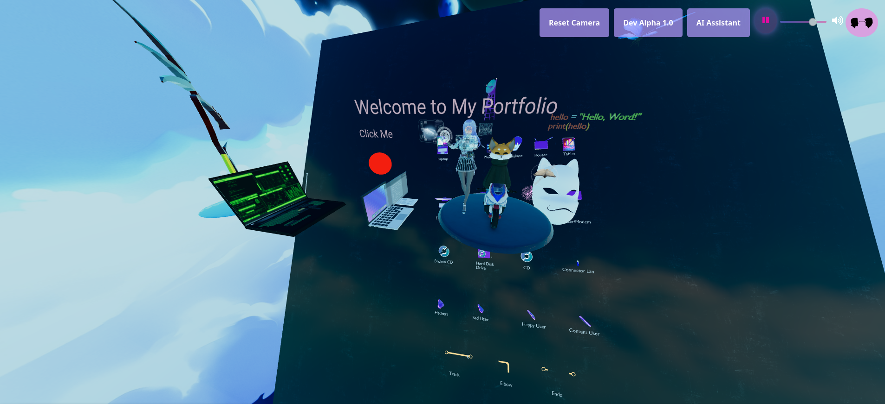
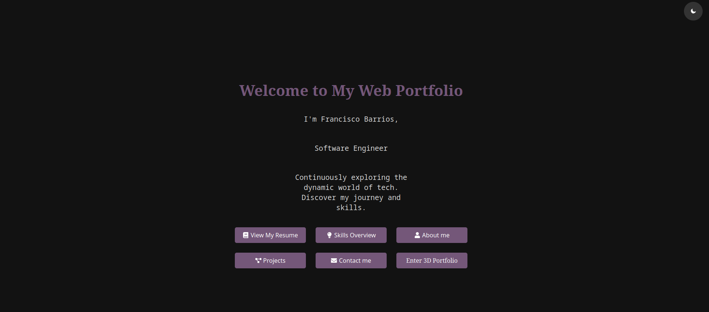

# 🌐 Francisco's portfolio: A React Typescript UI Project


## About The Project 📜
Within my portfolio I am utilizing the power of React and TypeScript to showcase professional skills and projects. It features a dynamic 3D environment using `@react-three/fiber`, interactive components, and an AI chatbot powered by OpenAI. Dive into a world where my professional accomplishments are not just listed, but experienced.

## Features 🌟
- Interactive 3D Models using `@react-three/drei` and `@react-three/fiber`
- AI Chatbot integration with OpenAI for dynamic user interactions
- Responsive and modern UI with React and TypeScript
- Elegant styling with SASS and FontAwesome Icons

## Getting Started 🚀

### Prerequisites 🛠️
- Node.js (v18.x.x)
- npm (v8.x.x)

### Installation 💾
1. Clone the repo:
```bash
git clone/git pull
```
2. Install NPM packages:
```bash
npm install
```

### Development Workflow 👨‍💻
1. To start the development server:
```bash
npm run dev
```
2. To build for production:
```bash
npm run build
```
3. To run lint checks:
```bash
npm run lint
```
## Docker Setup 🐳
This project includes Docker configuration for easy deployment.

1. Build the Docker image: docker build -t portfolio .
2. Run the Docker container: docker run -p 5000:5000 portfolio

## Major Technologies Used 💻
- React.js
- TypeScript
- Vite
- @react-three/fiber and @react-three/drei for 3D models
- Sass for styling
- FontAwesome for icons
- Axios for API requests
- OpenAI SDK
- Node.js and npm
- Docker for containerization

## License 📄
Distributed under the MIT License. See `LICENSE` for more information.

## Contact 📧
- Francisco Barrios - [https://www.linkedin.com/in/developerbarrios/](https://www.linkedin.com/in/developerbarrios/)
- Project Link: [https://github.com/shighetari/webportfolio](https://github.com/shighetari/webportfolio)

